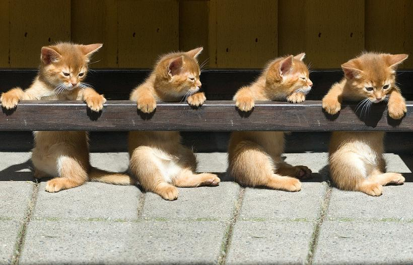

A mini Cats app created with Create React App, React Hooks, Redux, styled component and the https://docs.thecatapi.com/

Cats app

Getting started
Clone repo in teminal: git clone https://github.com/harunkisacuk/cat-app.git
Change directory with cd cat-app
Run yarn to install dependencies

Cats App

https://catsgallaryapp.herokuapp.com/

yarn start

runs the "app" in dev mode.
Open http://localhost:3000 to view it in your browser.

yarn test

launches the test runner in interactive watch mode.
Unfortunately jest has idiosyncracies re. coverage if nothing test-wise has changed between commits: you'll need to run yarn test --coverage --watchAll=false to see 100% code coverage in the terminal.
yarn test --coverage will still generate a coverage report in the project's root directory: coverage/lcov-report (reveal in finder to open coverage index.html files)

Requirements:
✔️ Use React Hooks, Redux, styled Component
✔️ Focus on architecture, code quality, and test coverage
✔️ Responsive

Considerations:
This was a deep dive into Redux. Challenging and thoroughly enjoyable for someone who has to use ContextAPI at work daily.
